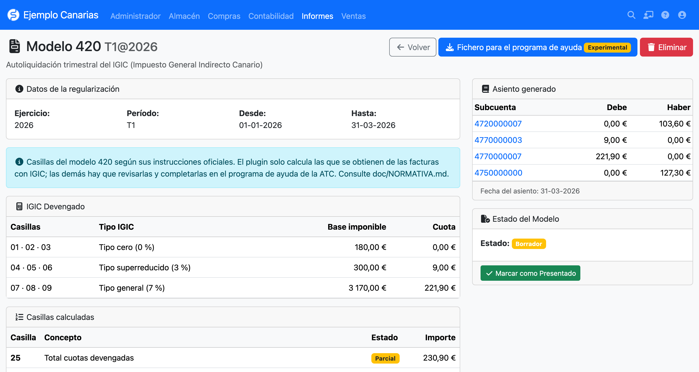

# ModelosIGIC para FacturaScripts

 
<small><a href="https://erseco.github.io/facturascripts-playground/?blueprint=https%3A%2F%2Fraw.githubusercontent.com%2Ferseco%2Ffacturascripts-plugin-ModelosIGIC%2Frefs%2Fheads%2Fmain%2Fblueprint.json">Pruébalo en tu navegador</a></small>

**Modelo 420** (autoliquidación trimestral del IGIC) y **Modelo 425** (declaración-resumen anual
del IGIC) de la **Agencia Tributaria Canaria (ATC)** para FacturaScripts. Calcula el IGIC
devengado y deducible a partir de las facturas, genera el asiento de regularización y un fichero
del Modelo 420 para importar en el programa de ayuda de la ATC (experimental).

  

## Origen

Este plugin es un **fork y evolución** de
[FacturaScripts/modelos_420_425_canarias](https://github.com/FacturaScripts/modelos_420_425_canarias),
el plugin original para FacturaScripts 2017 de Carlos García Gómez (NeoRazorX) y Francesc Pineda,
que dejó de ser compatible a partir de FacturaScripts 2018.

Se ha reescrito por completo para FacturaScripts moderno (2025.7 o superior), manteniendo la
licencia AGPL-3.0 y los créditos de los autores originales.

## Características

- **Modelo 420** (trimestral): casillas del IGIC devengado (ventas) y deducible (compras) por
  tipo impositivo para el trimestre elegido, con el estado de cada casilla (calculada, parcial o
  no calculada) y las líneas que no entran en el cálculo.
- **Normativa referenciada**: cada tipo, casilla y plazo cita su fuente oficial en
  [`doc/NORMATIVA.md`](doc/NORMATIVA.md). Lo que el plugin no puede obtener de FacturaScripts
  (bienes de inversión, importaciones, prorrata, regímenes especiales...) queda marcado para
  completarlo en el programa de ayuda de la ATC.
- **Asiento de regularización**: previsualización y creación del asiento contable del
  trimestre.
- **Modelo 425** (anual): casillas del resumen anual que se obtienen de las facturas del
  ejercicio y de los modelos 420 registrados.
- **Historial de declaraciones** con su estado (borrador, presentado, rectificado), número de
  referencia de la ATC, fecha de presentación y facturas incluidas.
- **Declaraciones rectificativas** a partir de una declaración ya presentada.
- **Fichero para el programa de ayuda** (experimental): fichero `.atc` del Modelo 420 con el
  formato del programa de ayuda oficial de la ATC (ejercicios 2025 y 2026). Se importa en el
  programa, que lo valida y desde el que se presenta. Ver
  [`doc/VALIDAR_FICHERO_ATC.md`](doc/VALIDAR_FICHERO_ATC.md).

## Uso

### Modelo 420

1. Ve a **Informes > Modelo 420**.
2. Pulsa **Nueva regularización**, elige el trimestre y el ejercicio y pulsa
   **Calcular** para ver la previsualización del asiento.
3. Pulsa **Guardar** para crear la regularización, el asiento contable y la declaración en
   borrador. Todo se guarda en una sola transacción: si algo falla no queda nada a medias.
4. Pulsa **Fichero para el programa de ayuda**, completa los datos que pide (dirección fiscal,
   casillas que el plugin no calcula, forma de pago) y descarga el `.atc`. Impórtalo en el
   programa de ayuda del 420, revísalo y presenta la declaración desde allí.
   **Experimental**: todavía no se ha usado para presentar una declaración real.
5. Marca la declaración como **presentada** indicando el número de referencia de la ATC.

### Modelo 425

1. Ve a **Informes > Modelo 425**.
2. Elige el ejercicio para ver el resumen anual del IGIC devengado y deducible.
3. Pulsa **Guardar** para registrar la declaración y, una vez presentada, márcala como
   **presentada**.

Las declaraciones guardadas se consultan en **Informes > Declaraciones IGIC**.

## Normativa

Las referencias a la normativa aplicada están en [`doc/NORMATIVA.md`](doc/NORMATIVA.md).
**La revisión de la normativa vigente está en curso**: antes de presentar una declaración,
comprueba los importes con el programa de ayuda de la ATC o con tu asesor.

## Instalación

1. Descarga el ZIP desde [Releases](../../releases/latest).
2. Ve a **Panel de Admin > Plugins** en FacturaScripts.
3. Sube el archivo ZIP y activa el plugin.

## Requisitos

- FacturaScripts **2025.7** o superior.
- PHP **8.1** o superior.
- Empresa con impuestos IGIC y plan contable configurados.

## Desarrollo

- `make upd` — arranca los contenedores Docker (FacturaScripts en <http://localhost:8081>)
- `make lint` — comprueba el estilo de código
- `make format` — corrige automáticamente el estilo
- `make test` — ejecuta los tests
- `make package VERSION=1.0` — genera el ZIP de distribución

## Créditos

- **Carlos García Gómez** (NeoRazorX) y **Francesc Pineda** — plugin original
  [modelos_420_425_canarias](https://github.com/FacturaScripts/modelos_420_425_canarias).
- **Ernesto Serrano** — reescritura para FacturaScripts moderno.

## Licencia

AGPL-3.0. Ver [LICENSE](LICENSE) para más detalles.
